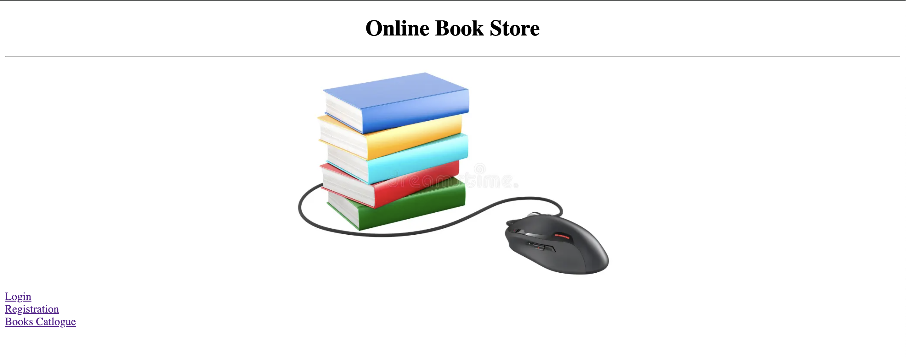
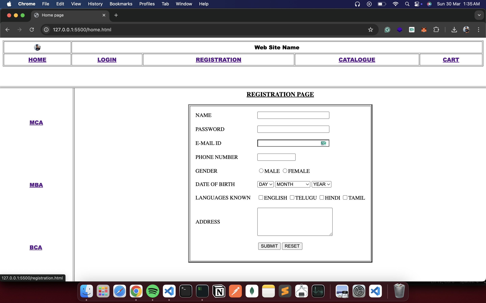
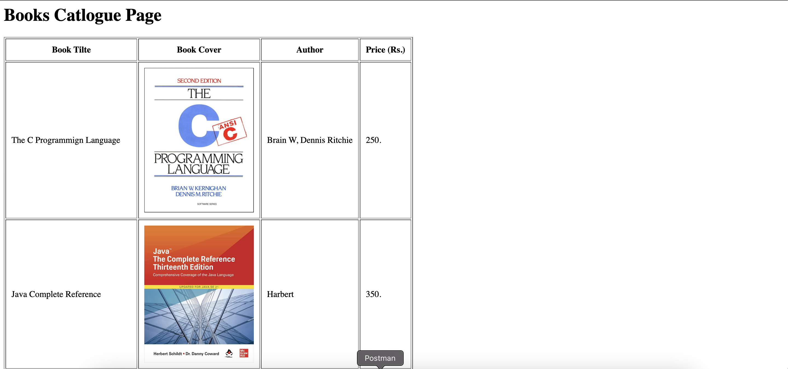

## <a href="https://downgit.github.io/#/home?url=https:%2F%2Fgithub.com%2Fmanohargella%2FLab%2Ftree%2Fmaster%2F2-2%2FwebTechnology%2FP_1 ">DOWNLOAD ZIP HERE [Manohar Link Hub]</a> 
## 1. Static Web Pages for Online Bookstore

### HOME PAGE
The static home page must contain three frames.

### LOGIN PAGE
The login page allows users to enter their credentials to access the bookstore.

### CATALOGUE PAGE
The catalogue page displays all available books in a table format.

### REGISTRATION PAGE
Users can register by providing their details on this page.

---

## Output Screenshots

### 1. Home Page Output

### 2. Login Page Output

### 3. Registration Page Output

### 4. Catalogue Page Output

