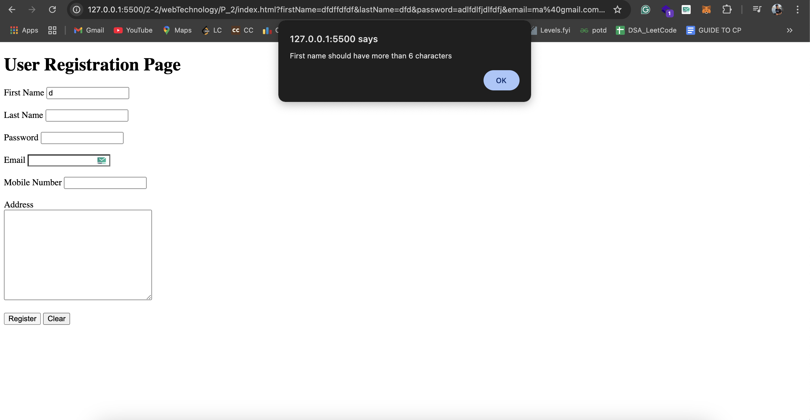

## 2. JavaScript Form Validation
- **First Name**: Must contain only alphabets and be at least 6 characters long.
- **Password**: Should be at least 6 characters long.
- **E-mail ID**: Must follow the standard format (name@domain.com).
- **Mobile Number**: Must contain exactly 10 digits.
- **Last Name & Address**: Should not be empty.

## Types of CSS
- **External**
- **Embedded**
- **Inline**

### Validation Output
