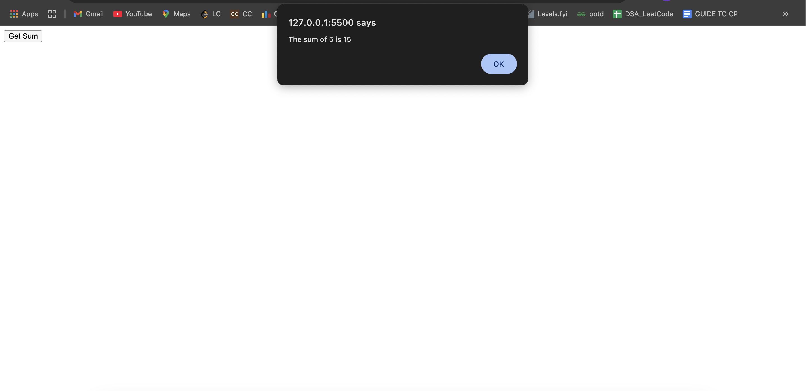

## 4. JavaScript with Pop-ups & Functions
- Display date using `onclick()` function.
- Compute factorial of a number using an alert.
- Display multiplication table of a number using an alert.
- Compute sum of numbers using prompt and confirm pop-ups.

### A - Show Date Output

### B - Show Factorial Output

### C - Show Table Output

### D - Show Sum Output

